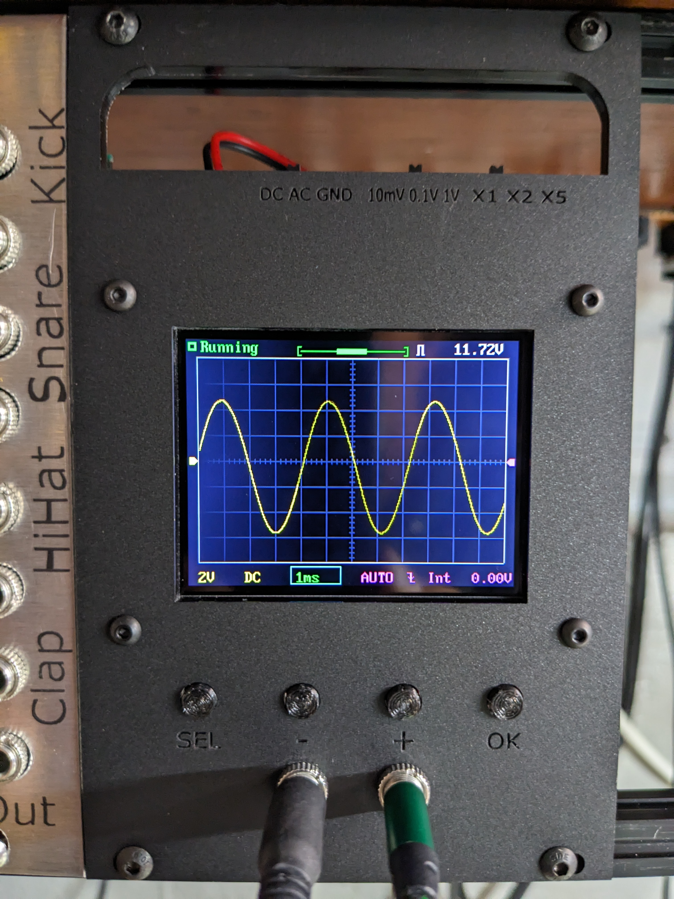

# Eurorack DSO138 mini
Simple panel and buttons for eurorack adaptation of a DSO138 mini oscilloscope. I didn't try to adapt the switches, instead I just did a simple cut out in the panel to access the switches that came with it.

## Specs
* 16HP

## BOM
| Description | Quantity | Link |
|-----|-----|-----|
| DSO138 mini kit | 1 | [Aliexpress](https://www.aliexpress.us/item/2251832872065620.html) (This is the one I bought, but there may be cheaper ones. I paid about 17USD for mine.) |
| Panel | 1 | [Laser cut acrylic](panel.svg) or 3D printed |
| Button caps | 4 | [3D printed](button_cap.stl) |
| Jacks (These form a passive multiple. I used two for my build) | 1 to 4 | [Tayda](https://www.taydaelectronics.com/3-5mm-earphone-mono-plug.html) |
| Standoffs | 4 | [Laser cut acrylic](panel.svg) or 3D printed |
| M2.5 x 20mm button head screws | 4 |  |
| M2.5 nuts | 4 |  |
| Power connector | 1 | [Tayda](https://www.taydaelectronics.com/dc-power-jack-2-1mm-round-type-panel-mount-1.html) or 16 pin eurorack header |

## Build notes
1. Assemble the kit with the following changes:
    * I left the LED off, it's a power LED and you can't see it anyway. It could be hooked up as a trigger LED from PA15.
    * Install right angled pin header instead of BNC connector.
    * I didn't install the second right angle battery pin header. Instead I saved this for a +5V connector.
    * I didn't bother with the power switch since I knew I would just have it turn on with the rest of my setup. Plus it won't be accessible once mounted in a rack.
1. Cut out the panel, or 3D print it. I used 3mm laser cut acrylic for mine. The file [panel.svg](panel.svg) is what I used for laser cutting. I expect the panel could be extruded for 3D printing too.
    * My panel was a little thick for my jacks so I milled the inside of the panel down a bit.
    * Inside the waste of the button cutouts of the panel are standoffs. These standoffs are for the screen to space it from the panel.
1. 3D print the button caps. [button_cap.stl](button_cap.stl) These caps should fit over the 6mm tall buttons which come with the kit.
1. Install the jacks in the panel wired as a passive multiple.
1. Use the longer cable to connect the probe pin header to the installed jacks. Red to tips, black to grounds.
    * You can also reference this [PDF](DSO138mini_PowerSupplyOptions.pdf) for more information about powering the scope.
1. There's a nice prototyping section on the analog board. I used this to install the second pin header. Then wired to the SW4's inner center leg (the one with the trace). I connected the ground to the unused charger board ground hole.
    * These's plenty of space on this prototyping area. If you want, you could connect a 16 pin eurorack header.
1. Use the shorter cable to connect to a power jack.
